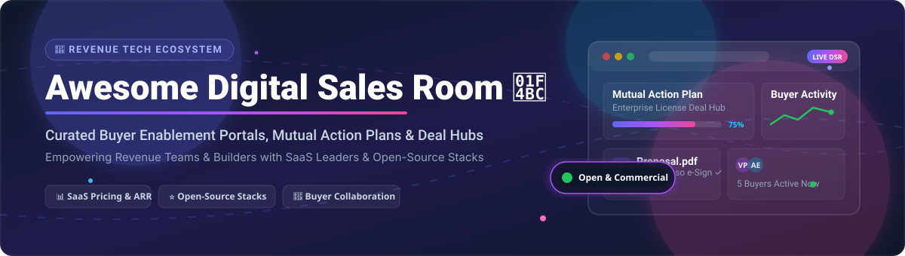
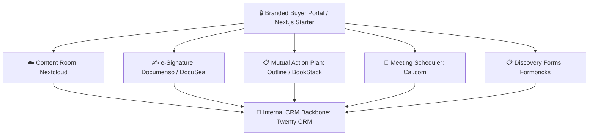

  

# 💼 Awesome Digital Sales Room Ecosystem 🚀

> **A Curated Directory of Digital Sales Rooms (DSR), Buyer Enablement Portals, Mutual Action Plans (MAP), Deal Collaboration Hubs, and Open-Source Building Blocks for B2B Revenue Teams.** 📈

---

## 📌 Table of Contents

- [📊 Market Overview & Size](#-market-overview--size)
- [🏢 SaaS & Hosted Digital Sales Room Platforms](#-saas--hosted-digital-sales-room-platforms)
- [🛠️ Open-Source GitHub Projects & DIY Stacks](#️-open-source-github-projects--diy-stacks)
- [🧩 Composable Open-Source Architecture](#-composable-open-source-architecture)
- [🤝 How to Contribute](#-how-to-contribute)
- [💖 Support & Sponsorship](#-support--sponsorship)
- [⚠️ Disclaimer](#️-disclaimer)
- [📈 Star History](#-star-history)

---

## 📊 Market Overview & Size

The **Digital Sales Room (DSR) & Buyer Enablement** market is estimated at **$2.8 Billion in 2026** and is projected to reach **$6.5 Billion by 2033** (CAGR ~12.8%). 

📈 **Market Structure & Dynamics**:
The sector is currently **moderately fragmented**. While legacy revenue enablement giants (like Highspot, Seismic, and Showpad) dominate enterprise content management, specialized DSR category leaders (such as GetAccept, Dock, Aligned, and Trumpet) compete aggressively for mid-market and PLG sales teams. As buying processes transition to self-guided, multi-stakeholder buyer journeys, the market is gradually moving toward consolidation around platforms that combine **AI deal workspaces**, **Mutual Action Plans (MAP)**, and **real-time engagement analytics**.

---

## 🏢 SaaS & Hosted Digital Sales Room Platforms

The following commercial SaaS platforms offer turnkey, branded Digital Sales Rooms complete with engagement analytics, buyer portals, CRM integrations, and automated contract workflows.

*The table below is sorted by **Company Size / ARR** in descending order.* 🔽

| 🏢 Platform | 📝 Description | 💰 Starting Price | 🎁 Free Tier / Trial Limit | 📊 Company Size (ARR / Funding / Status) |
| :--- | :--- | :--- | :--- | :--- |
| **[GetAccept](https://www.getaccept.com/)** 📄 | Digital sales room platform with e-signatures, interactive video proposals, contract management, and CRM analytics. | **$15** / user / month (Essential Plan) | **14-day free trial** (Full access, no credit card required) | **~$31.6M ARR** ($30.6M Total Funding) |
| **[Salesflow](https://salesflow.io/)** ⚡ | Outbound deal engagement, automated buyer follow-up, and multi-channel deal collaboration. | **$79** / seat / month (billed annually) | **3-day free trial** (Unlimited campaign features) | **~$12.0M ARR** (Bootstrapped / Profitable) |
| **[ClientPoint](https://www.clientpoint.net/)** 💼 | All-in-one business relationship portals, proposal generation, content rooms, and live deal meeting spaces. | **$83** / user / month (Standard Plan) | **Free Plan available** (Up to 3 active deal rooms) | **~$6.3M ARR** ($5.0M Total Funding) |
| **[Dock](https://www.dock.us/)** 🚪 | Modern buyer portals, onboarding workspaces, mutual action plans, and content sharing integrated with HubSpot/Salesforce. | **$350** / month (Standard Plan, includes 5 seats) | **Free Plan available** (Up to 5 active deal workspaces) | **~$3.2M ARR** (Venture-Backed) |
| **[Trumpet](https://www.trumpet.app/)** 🎺 | Hyper-personalized dynamic buyer pods, interactive Mutual Action Plans, and real-time deal signals. | **$29** / seat / month (Pro Plan) | **Free Forever Plan** (Up to 3 active Pods, 1 user) | **~$2.5M ARR** (~$9.0M Total Funding) |
| **[Aligned](https://www.alignedup.com/)** 🎯 | AI-powered champion-led deal workspaces, mutual action plans, and buyer stakeholder tracking. | **$29** / seat / month (Pro Plan) | **Free Forever Plan** (Up to 3 active deal rooms) | **Tripled Revenue YoY** ($73.8M Series B Funding) |
| **[Journeybee](https://journeybee.io/)** 🐝 | Customer onboarding portals, deal collaboration rooms, and partner relationship management (PRM). | **$499** / month (Flat-rate Unlimited Users) | **14-day free trial** (Full platform access) | **~$1.5M ARR** (Bootstrapped) |
| **[DealRoom](https://dealroom.net/)** 🤝 | M&A deal collaboration, virtual data rooms, due diligence tracking, and enterprise pipeline management. | **$625** / month (billed annually, flat-rate) | **14-day free trial** (Custom demo & sandbox access) | **Enterprise / Mid-Market** (M&A Focused) |
| **[Recapped](https://www.recapped.io/)** 📋 | Mutual action plan and client onboarding platform *(Note: Service sunset announced July 2026)*. | **$600** / month (Legacy Team Plan) | **Free Plan (Legacy)** (1 user limit) | **Sunset / Inactive** (Acquired / Phased out) |

---

## 🛠️ Open-Source GitHub Projects & DIY Stacks

While dedicated DSR SaaS products provide polished out-of-the-box experiences, engineering and revenue ops teams can build **custom, self-hosted Digital Sales Rooms** using modular open-source building blocks for CRM, document collaboration, e-signatures, scheduling, and forms.

*The table below is sorted by **GitHub Star Count** in descending order.* 🔽

| 📦 Open-Source Project | ⭐ GitHub Stars | 🏷️ Category | 📝 Description & Deal Room Use Case |
| :--- | :--- | :--- | :--- |
| **[Nextcloud](https://github.com/nextcloud/server)** ☁️ |  | **Content Room & Cloud Storage** | Open self-hosted workspace to create branded deal folders, share secure proposal documents with password protection, and chat via Nextcloud Talk. |
| **[Twenty CRM](https://github.com/twentyhq/twenty)** 🎯 |  | **Open-Source CRM** | Modern open-source CRM alternative to Salesforce. Can be extended with shared buyer views and custom deal pipelines. |
| **[Cal.com](https://github.com/calcom/cal.com)** 📅 |  | **Open Scheduling Engine** | Embeddable open-source scheduling infrastructure to allow buyers to book follow-up demo calls directly within deal rooms. |
| **[Paperless-ngx](https://github.com/paperless-ngx/paperless-ngx)** 📄 |  | **Document Management** | Open-source document indexing and archiving system with full-text OCR for managing sales collateral, security questionnaires, and RFPs. |
| **[Documenso](https://github.com/documenso/documenso)** ✍️ |  | **Open E-Sign Platform** | Open-source e-signature tool (DocuSign alternative) designed to execute contracts, NDAs, and proposals inside custom buyer portals. |
| **[DocuSeal](https://github.com/docuseal/docuseal)** 🔒 |  | **Open E-Sign Engine** | Document signing tool with document builder, form fields, and seamless API integration for automated contract execution. |
| **[Outline](https://github.com/outline/outline)** 📖 |  | **Knowledge Base & Wiki** | Fast, collaborative team knowledge base ideal for publishing buyer-facing Mutual Action Plans (MAPs) and technical documentation. |
| **[Formbricks](https://github.com/formbricks/formbricks)** 📋 |  | **Buyer Feedback & Survey** | Open-source Qualtrics alternative for collecting buyer discovery information, stakeholder feedback, and procurement requirements. |
| **[OpenSign](https://github.com/OpenSignLabs/OpenSign)** 🖊️ |  | **Open E-Sign Solution** | Open-source digital signature software for signing and securing PDF documents with full audit trail compliance. |
| **[BookStack](https://github.com/BookStackApp/BookStack)** 📚 |  | **Deal Playbooks & Docs** | Simple, self-hosted documentation system structured like books to organize buyer onboarding materials and product specs. |
| **[HedgeDoc](https://github.com/hedgedoc/hedgedoc)** 📝 |  | **Real-Time Collaborative Docs** | Collaborative markdown editor for real-time joint document editing and proposal draft collaboration with prospects. |

---

## 🧩 Composable Open-Source Architecture

For technical revenue teams wishing to maintain total data ownership and custom branding, a practical **DIY Digital Sales Room Stack** can be assembled as follows:

---

## 🤝 How to Contribute

Contributions to expand and update this list are warmly welcomed! 🌟

1. 🍴 **Fork** this repository.
2. 📝 **Add/Edit** entries in `README.md` following the exact tabular format above.
3. 🔍 Ensure descriptions are factual, links are accurate, and pricing/star badges match current data.
4. 🚀 Submit a **Pull Request (PR)** with a clear title and summary.

---

## 💖 Support & Sponsorship

Thank you for exploring this repository! If you find this digital sales room curated list helpful, please consider supporting the project:

- ⭐ **Star** this repository to show your support!
- 🍴 **Fork** and contribute new tools or updates.
- 📢 **Share** with your revenue operations & sales engineering teams.
- ☕ **Buy Me a Coffee / Sponsor**: Support ongoing maintenance on the [GitHub Sponsor Dashboard](https://github.com/sponsors/ishandutta2007).

---

## ⚠️ Disclaimer

- This repository is a **community-curated list** for informational and research purposes only.
- Digital Sales Rooms often process sensitive commercial data and personal buyer information. Always enforce access controls, set link expiration, and comply with privacy regulations (GDPR/CCPA).
- Company revenue/valuation estimates are compiled from public market data and industry intelligence reports.

---

## 📈 Star History

---

  <b>Made with ❤️ for Revenue Operations, Enterprise Account Executives, and Sales Engineers.</b>

